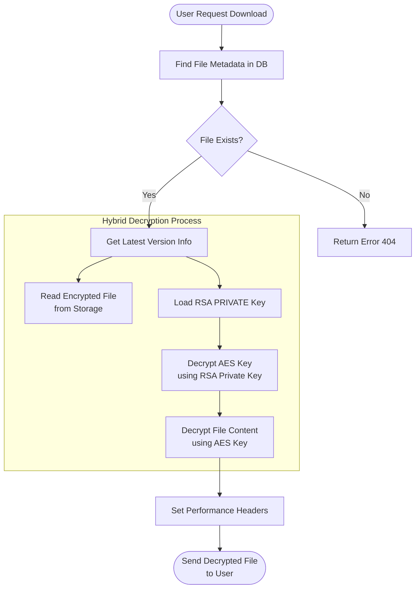

# Flowchart Sistem Secure File Sync

Berikut adalah representasi visual dari alur logika sistem coding Anda.

## 1. Arsitektur Umum & Alur Upload (Hybrid Encryption)

Diagram ini menjelaskan bagaimana sistem menangani upload file baru: mengenkripsi isi file dengan AES, dan mengunci kunci AES tersebut dengan RSA.

```mermaid
graph TD
    A([User Upload File]) --> B{File Valid?}
    B -- No --> C[Return Error 400]
    B -- Yes --> D[Generate Random AES Key<br/>(32 bytes)]
    
    subgraph "Hybrid Encryption Process"
        D --> E[Encrypt File Content<br/>using AES-256-CBC]
        D --> F[Load RSA PUBLIC Key]
        F --> G[Encrypt AES Key<br/>using RSA Public Key]
        A --> H[Generate Hash SHA-256<br/>of Original File]
    end

    E --> I[(Save Encrypted File<br/>to Local Storage)]
    G --> J[(Save Metadata to MongoDB)]
    H --> J
    I --> K[Return Success JSON<br/>(+ Performance Metrics)]
```

## 2. Alur Update File (Versioning)

Diagram ini menunjukkan logika update file, termasuk *guardrail* (pengecekan hash) yang baru saja kita tambahkan untuk memastikan tugas besar terpenuhi.

```mermaid
graph TD
    A([User Update File]) --> B[Generate SHA-256 Hash<br/>of New File]
    B --> C{Hash == Latest Version Hash?}
    C -- Yes (Identik) --> D[Return Error 400<br/>"File content IDENTICAL"]
    C -- No (Berbeda) --> E[Generate New AES Key]
    
    subgraph "Re-Encryption Process"
        E --> F[Encrypt New Content<br/>(AES-256)]
        E --> G[Encrypt New AES Key<br/>(RSA Public)]
    end

    F --> H[(Save New Encrypted File<br/>to Storage)]
    G --> I[Push New Version Object<br/>to MongoDB Array]
    H --> I
    I --> J[Return Success JSON<br/>(Version +1)]
```

## 3. Alur Download (Decryption)

Diagram ini menjelaskan bagaimana sistem mengembalikan file asli dari file terenkripsi yang tersimpan.



## 4. Penjelasan Komponen (Untuk Laporan)

Jika Anda perlu menyalin ini ke dalam laporan Word/PDF:

1.  **User Interface (Postman)**:
    *   Bertindak sebagai klien yang mengirim permintaan HTTP (POST/GET).
2.  **API Gateway (Express.js)**:
    *   Menerima request, memvalidasi input (multer), dan mengarahkan ke controller yang tepat.
3.  **Crypto Engine (Node.js Crypto)**:
    *   **AES-256-CBC**: Digunakan untuk mengenkripsi *payload* (isi file) karena cepat dan efisien untuk data besar.
    *   **RSA-2048**: Digunakan hanya untuk mengenkripsi *kunci AES*. Ini memecahkan masalah distribusi kunci (Key Encapsulation).
    *   **SHA-256**: Digunakan untuk *fingerprint* digital. Jika hash berubah, berarti file berubah (integritas & versioning).
4.  **Database (MongoDB)**:
    *   Hanya menyimpan *metadata*: nama file, path lokasi file terenkripsi, hash, dan kunci AES yang sudah terenkripsi. Tidak menyimpan isi file.
5.  **Storage (Local Filesystem)**:
    *   Menyimpan blob binary file yang sudah terenkripsi (`.enc`). File di sini tidak bisa dibaca tanpa proses dekripsi melalui API.
